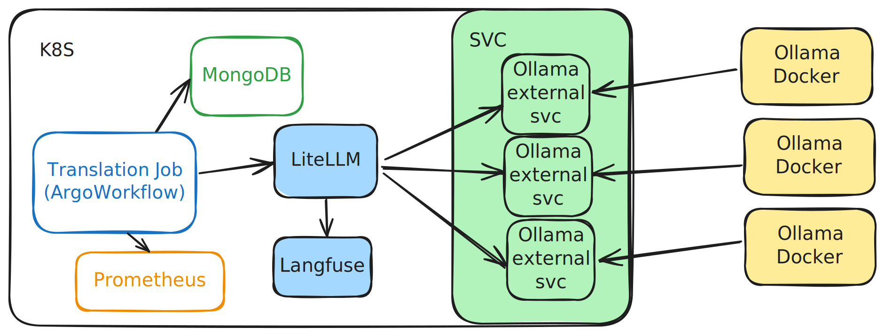

# Translation powered by LLM
Nowadays, it's very handy to have LLM translate text for us in almost any language. ChatGPT is my daily translator now. It's powerful and easy to use. However, if you have a large amount of documents to translate, the problem becomes challenging. In this article, I will show you my journey to create a translation service powered by LLM with an infrastructure based on Kubernetes.

## Objective  
As a father of two kids, my children are always sick. I have to check on the medical information in different languages.  
Recently, I decided to translate an archive(a subset) of notices from [BASE DE DONNÉES PUBLIQUE
DES MÉDICAMENTS](https://base-donnees-publique.medicaments.gouv.fr) into English and Chinese for daily use. The total amount of notices is 14k. Although I have only a minor subset downloaded, it would be a nightmare to translate them using the chatGPT interface. You can find an example of the notice here [DOLIPRANE 1000 mg, comprimé - Notice patient](https://base-donnees-publique.medicaments.gouv.fr/affichageDoc.php?specid=60234100&typedoc=N).
So I need to create a translation service to handle this task and make it easy to use so that I can reuse it in the future when the notices are updated. 
The service should:  
- Low cost 
- Translate the text from any language to another language. (I want my friends to use it too) 
- Be able to handle a large amount of text
- Format the output in a readable way/ programmatically processable way (So that I can show it in an web interface)   

## The plan   
Use commercial APIs to set up a baseline as their quality is generally good. Then compute the cost. If the cost is too high, I will try to use local LLM to create a translation service.   
I will begin with a prompt engineering with OpenAI chat, and test the prompt on several local models at the same time. Then based on the cost and the quality of the translation, I will choose the final solution. At the begining, I will work on fixed language pairs, French to English and French to Chinese.  

## The prompt engineering  
To begin with the work, a good prompt will save us a lot of time. 

### An example of prompt
I took advantage of an prompt from Dify.ai. You can find the workflow [here](https://github.com/aws-samples/dify-aws-tool/blob/main/workflow/term_based_translation_workflow.yml). To summarize, this a multi-step workflow for term-based translation. It does: 
1. Identify the technical terms and make a glossary for them.
2. Direct translation of the text.
3. Identify the problems of translation. 
4. Refine the translation based on the problems identified. 

The prompts are as follows:   

**Step1**
```markdown
<Task> Identify the technical terms in the users input. Use the following format {XXX} -> {XXX} to show the corresponding technical terms before and after translation. 

<Input Text> 
{{input_text}}

<Example>
Transformer -> Transformer
Token -> Token 
Zero Shot -> 零样本
Few Shot -> 少样本
<Technical Terms> 
```  

**Step2**
```markdown
<Task> You are a professional translator proficient in Simplified Chinese especially skilled in translating professional academic papers into easy-to-understand popular science articles. Please help me translate the following english paragraph into Chinese, in a style similar to Chinese popular science articles .
<Constraints> 
Translate directly based on the English content, maintain the original format and do not omit any information. 
<Before Translation> 
{{input_text}}
<Direct Translation> 
```

**Step3**
```markdown
<Task>
Based on the results of the direct translation, point out specific issues it have. Accurate descriptions are required, avoiding vague statements, and there's no need to add content or formats that were not present in the original text, including but not liimited to: 
- inconsistent with chinese expression habits, clearly indicate where it does not conform
- Clumsy sentences, specify the location, no need to offer suggestions for modification, which will be fixed during free translation
- Obscure and difficult to understand, attempts to explain may be made
<Direct Translation>
{{step2.text}}
<Original Text>
{{input_text}}
<Problems with the Direct Translation>
```

**Step4**
```markdown
Based on the results of the direct translation in the first step and the problems identified in the second step, re-translate to achieve a meaning-based interpretation. Ensure the original intent of the content is preserved while making it easier to understand and more in line with Chinese expression habits. All the while maintaining the original format unchanged. 
<Direct Translation> 
{{step2.text}}
<problems in the first translation>
{{step3.text}}
<Meaning-Based Translation> 
```

This prompt gives us a good start. These steps are expensive together. And there is a bug in the workflow: the step 1 's output is not used in the following steps. 

I also tried to make it with Chain of Thought. The result is not good and it is no longer deterministic in terms of translation quality and formatting for our task.

### My prompt
After several trials with ChatGPT and local LMs with LM Studio, I found that the following prompt is enough for my task. 

```markdown
<TASK> You are a professional translator proficient in Simplified Chinese, specializing in translating medical and academic materials into accessible, popular science articles. 
<CONSTRAINTS> 
Don't translate `{product_name}` if it is present in the text.
Translate directly from the French content to **Simplified Chinese**.
You should not add contents that are not in the original text. 
Output the translation with json schema
\```
{{
    "french_text": "{{french_text}}",
    "chinese_translation": "{{chinese_translation}}"
}}
\```


<TEXT TO TRANSLATE>
\```
{to_translate}
\```
<EXAMPLES>
<EXAMPLE1>
\```
Classe pharmacothérapeutique : Agent antinéoplasiques. Code ATC : L01CD04.
\```
<EXAMPLE1-OUTPUT>
\```
{{
    "french_text": "Classe pharmacothérapeutique : Agent antinéoplasiques. Code ATC : L01CD04.",
    "chinese_translation": "药物分类：抗肿瘤药。ATC编码：L01CD04。"
}}
\```
<EXAMPLE2>
\```
CABAZITAXEL REDDY PHARMA 60 mg solution à diluer et solvant pour solution pour perfusion est utilisé pour traiter le cancer de la prostate qui a progressé après avoir eu une autre chimiothérapie. Il fonctionne en stoppant la croissance et la multiplication des cellules.
\```
<EXAMPLE2-OUTPUT>
\```
{{
    "french_text": "CABAZITAXEL REDDY PHARMA 60 mg solution à diluer et solvant pour solution pour perfusion est utilisé pour traiter le cancer de la prostate qui a progressé après avoir eu une autre chimiothérapie. Il fonctionne en stoppant la croissance et la multiplication des cellules.",
    "chinese_translation": "CABAZITAXEL REDDY PHARMA 60 mg溶液用于治疗前列腺癌，该癌在其他化疗后进展。它通过阻止细胞的生长和分裂来发挥作用。"
}}
\```
```

There are several things to note:   
- the `<>` is used to indicate the task and constraints. Some may prefer [] but I found that <> is more effective.  
- the contraints are important. It's better to have them in the prompt. And the contraints should be clear and easy to understand. 
- the examples are important. This makes the few-shot prompting. They help the model to understand the task and the constraints. It's crucial to have the corresponding examples for each language pair and it will be the future improvement of the prompt.
- the output should be in a json format. It's easy to process the output in a programmatic way.  

## The document processing strategy  
The HTML document contains a lot of house-baked tags, which are not easy to process. After some trails, I converted the HTML to a json format. This allows us to keep the structure of the document and to process the text easily. 

```json
{
    "title": "DOLIPRANE 1000 mg, comprimé - Notice patient",
    "sections": [
        {
            "title": "1. QU'EST-CE QUE DOLIPRANE 1000 mg, comprimé ET DANS QUELS CAS EST-IL UTILISE ?",
            "content": [
                {
                    "type": "text",
                    "text": "Classe pharmacothérapeutique – code ATC : N02BE01",
                },
                {
                    "type": "text",
                    "text": "DOLIPRANE 1000 mg, comprimé contient du paracétamol. Le paracétamol est un antalgique (calme la douleur) et un antipyrétique (fait baisser la fièvre).",
                }
                ...
            ],
            "subsections": []
        },
        {
            "title": "2. QUELLES SONT LES INFORMATIONS A CONNAITRE AVANT DE PRENDRE DOLIPRANE 1000 mg, comprimé ?",
            "content": [
                {
                    "type": "text_bold",
                    "text": "Ne prenez jamais DOLIPRANE 1000 mg, comprimé :",
                },
                {
                    "type": "bullet1",
                    "text": " si vous êtes allergique au paracétamol ou à l'un des autres composants contenus dans ce médicament, mentionnés dans la rubrique 6,",
                },
                ...
    ],
    "last_update_date": "2024-06-17 00:00:00"
}
```

This allows us the retrieve the information from the document easily by sections. 

Before fixing the prompt, I tried to translate the whole raw document with the prompt. The result was not good. The translation was not accurate and the output was not readable. Then I tried to pass the json format to the model. The model failed to keep the keys in the json format, the keys are also translated and it caused a lot of problems.   
The final solution is just pass sentence by sentence to the model. This allows the model to focus on the sentence and to keep the structure of the json format. 

I am still working on the prompt. The next step will be adding more context to the prompt and not just the single sentence. So far, the prompt works well on most of the cases.   

## The cost and the choices of models
### commercial APIs
By translating the doc sentence by sentence, the cost is very high. By using OpenAI 4o, translate a single doc as a whole with the prompt cost at total about 500 dollars. It's not acceptable at all. As a tier-1 user of OpenAI, the rate limit is 500 RPM. I can translate about 3 docs per minute. It's still too slow. 
Even with the batch API, the cost is still too high for this task.
There is Deepseek's API which is known for its low cost. But it's still $0.14 / 1M tokens for Input, and $0.28/1M tokens. 
### Local LLM
I then try to use the local LLM to create a translation service.   
With the local LLM of max size of 7B (4B quantization), the cost is just my electricity bill and more time to wait. By using 2 RTX A2000 6GB (70 Watt TDP) and 1 RTX 3090 (undervolting to 250 Watt), I can translate ~4 doc in 1 minute. It's acceptable. 
I tried several models:
- Mistral-7B 
- LLaMa3.2 8B 
- LLaMa3.2 1B
- Qwen2.5 7B
- Qwen2.5 1.5B   
- Yi-1.5 6B
... 

LLaMa and Mistral are not good at Chinese. Qwen2.5 is shockingly good. And the most shocking part for me is that the 1.5B model is good enough for a lot of things and not just translation. 

## The final solution  
### The model and the prompt
With all the elements above, the solution is clear. I will use the Qwen2.5 1.5B model to create a translation service on my GPUs. The translation will be on sentence level, and the output will be in a json format. 
### The devices 
- 2 RTX A2000 6GB (70 Watt TDP)   

I didn't use the RTX 3090 finally because it's too power hungry and noisy for the room. 
At the begining, I asked help from my friend to use his GPU but the latency was too high. 
### The tech stack - with Kubernetes
- Argo Workflow for the translation job running
- Ollama for the model serving (External service)
- LiteLLM as model as LLM Gateway (proxy)
- MongoDB for the document storage 
- Langfuse for LLM calls tracing
- Prometheus for the monitoring of the job

The illustration of the architecture is as follows:  


The Ollama services are deployed as external services instead of internal pods with GPU Operators in K8S, so that I can turn off the machines when I don't need them and the service is still available without breaking the kubernetes cluster. I only turn on the GPU machines when I need to run the model. 

In the future posts, I will show you how the infrastructure is done. 

### LiteLLM configuration   
At the beginning, there is no LiteLLM and I mixed several machines. So I handled the load balancing within my Python code to make a round-robin call to the models. It's not efficient and not scalable.   
Then I discovered LiteLLM. I decided to make it my general LLM Gateway.   
I setup my configuration based on its tutorial. The configuration is as follows: 
```yaml
model_list:
  - model_name: qwen2.5:1.5b
    litellm_params:
      model: ollama/qwen2.5:1.5b
      api_base: http://192.168.88.252:11434 # RTX A2000
      api_key: anything
      tpm: 100
  - model_name: qwen2.5:1.5b
    litellm_params:
      model: ollama/qwen2.5:1.5b
      api_base: http://192.168.88.251:11434 # RTX A2000
      api_key: anything
      tpm: 100
  - model_name: qwen2.5:1.5b
    litellm_params:
      model: ollama/qwen2.5:1.5b
      api_base: http://192.168.88.253:11434 # RTX 3090
      api_key: anything
      tpm: 100
  - model_name: gpt-4o
    litellm_params:
      model: gpt-4o
      api_base: https://api.openai.com
      api_key: <your-api-key>
      rpm: 500
```

Don't forget the reason to use LiteLLM is to use its routing strategies. There are several strategies available:   
- Weighted Pick
- Rate Limit Aware
- Least Busy
- Latency Based
- Cost Based

I used the default strategy which is the Weighted Pick. It's enough for my case. It chooses the model based on the RPM (requests per minute) and TPM (tokens per minute) as the weight.
For more information, you can check the [LiteLLM documentation](https://docs.litellm.ai/docs/routing#advanced---routing-strategies-%EF%B8%8F).

With Ollama, the TPM can be retrieved with the following command: 
```bash
ollama run --verbose <model_name>
```
example output (from my macbook): 
```bash
total duration:       2.127984959s
load duration:        29.685625ms
prompt eval count:    526 token(s)
prompt eval duration: 595ms
prompt eval rate:     884.03 tokens/s
eval count:           93 token(s)
eval duration:        1.243s
eval rate:            74.82 tokens/s
```

### Langfuse tracing 
Langfuse is a tool to trace the LLM calls. It's very useful to debug the LLM calls. I use the selfhost version which lacks of the prompt engineering feature. The web UI is very cool for the tracing. And the SDK is very easy to integrate in my job. 

Here is the example from the doc of Langfuse, you can check more information [here](https://langfuse.com/docs/integrations/litellm/example-proxy-python).   
```python
import os

from langfuse.openai import openai
from langfuse.openai import openai
 
os.environ["LANGFUSE_PUBLIC_KEY"] = ""
os.environ["LANGFUSE_SECRET_KEY"] = ""
os.environ["LANGFUSE_HOST"] = "https://mylangfuse.com"
 
# Test connection to Langfuse, not recommended for production as it is blocking
openai.langfuse_auth_check()

 
# Set PROXY_URL to the url of your lite_llm_proxy (by default: http://0.0.0.0:4000)
PROXY_URL="http://mylite_llm_proxy.com"
 
system_prompt = "You are a very accurate calculator. You output only the result of the calculation."
 
# Configure the OpenAI client to use the LiteLLM proxy
client = openai.OpenAI(base_url=PROXY_URL)
 
gpt_completion = client.chat.completions.create(
  model="gpt-3.5-turbo",
  name="gpt-3.5", # optional name of the generation in langfuse
  messages=[
      {"role": "system", "content": system_prompt},
      {"role": "user", "content": "1 + 1 = "}],
)
print(gpt_completion.choices[0].message.content)
 
llama_completion = client.chat.completions.create(
  model="ollama/llama3",
  name="llama3", # optional name of the generation in langfuse
  messages=[
      {"role": "system", "content": system_prompt},
      {"role": "user", "content": "3 + 3 = "}],
)
print(llama_completion.choices[0].message.content)

```


## Final words 
In this article, I showed you my journey to create a translation service powered by LLM. There are more to do: 
- The prompt engineering is not finished. I need to add more context to the prompt. 
- A more flexible way to handle different languages. 
- The infrastructure is not finished. I need to show you how to deploy the service with Kubernetes.
- The Translation is not validated. I am currently exploring the validation process by using the LLM as judge method. I am trying to do it the agentic way with several frameworks like: Dspy, Autogen, Pydantic.ai, Swarm, and more. So far, I found that the Autogen's Society of Mind Agent with RoundRobinGroupChat is very funny. 

I hope you enjoyed the article. If you have any suggestions, please let me know. 

In the next article, I will show you my exploration on different agentic frameworks to validate the translation. 


## References
- [Prompt Engineering Guide](https://www.promptingguide.ai) 
- [BASE DE DONNÉES PUBLIQUE DES MÉDICAMENTS](https://base-donnees-publique.medicaments.gouv.fr) - The source of the notices and the [License](https://base-donnees-publique.medicaments.gouv.fr/docs/licence_bdpm.pdf)
- [LiteLLM documentation](https://docs.litellm.ai/docs) - The LLM Gateway
- [Langfuse documentation](https://langfuse.com/docs) - LLM engineering platform
- [Ollama documentation](https://docs.ollama.ai/docs) - Ollama is a lightweight, extensible framework for building and running language models on the local machine.
- [Dify.ai](https://dify.ai) The next-gen development platform - Easily build and operate generative AI applications. Create Assistants API and GPTs based on any LLMs.
